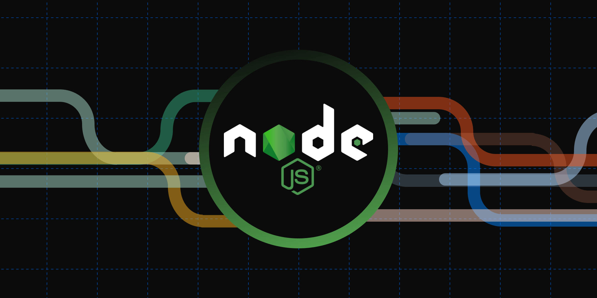

# NodeJs Cookbook 
Welcome to the Cookbook repository! This repository is a collection of tiny programs that demonstrate various programming concepts using the programming languages we work with, including JavaScript and Node.js. The Cookbook Method is an effective approach to learning programming languages by gradually building a repertoire of small programs, each focusing on a specific concept. This process empowers you to enhance your programming skills incrementally.

# Getting Started
If you're new to programming or the languages we cover, it's recommended to start with one language, like JavaScript, and gradually build up your collection of code snippets. Begin with the basics, such as the "Hello World" program, and then progressively expand your knowledge by adding more complex snippets on top of it.

# Who Is This Cookbook For?
Beginners: If you're just starting out, this cookbook is an excellent resource to establish your foundational understanding. The step-by-step nature of the Cookbook Method allows you to grasp programming concepts systematically.

Experienced Developers: Even if you're already an experienced developer, you can benefit from this cookbook. You might use it to explore a new programming language you haven't worked with before or to delve into advanced topics within a language you're already familiar with.

# How to Use This Cookbook
Each code snippet in this repository focuses on a specific programming concept. The snippets are organized in a way that facilitates easy referencing and learning. You can use this cookbook in several ways:

1. Learning: If you're learning a new concept, search for a relevant snippet in the repository. Read the code, understand how it works, and modify it to see how different changes affect the outcome.

2. Quick Reference: As you become more proficient, this cookbook can serve as a quick reference. Whenever you encounter a problem related to a concept you've studied, find the corresponding snippet to guide you.

3. Project Development: When working on projects, you might encounter situations where you need to implement specific tasks. Drawing from your cookbook snippets, you can quickly assemble a solution tailored to your project's needs.

# Example Use Case
Let's consider a practical scenario. Imagine you need to make an HTTP request to an API, parse the JSON response, generate a CSV spreadsheet, and then email that spreadsheet. Since you've been maintaining your own cookbook snippets for these actions, tackling this challenge becomes straightforward. You can assemble the necessary code pieces from your cookbook and create a program that accomplishes the task efficiently.

Remember, this cookbook is a dynamic resource that evolves as you learn and grow. Feel free to contribute your own snippets or suggest improvements to existing ones. Together, we can build a valuable collection of code that benefits both beginners and experienced developers alike.

Happy coding! 🚀